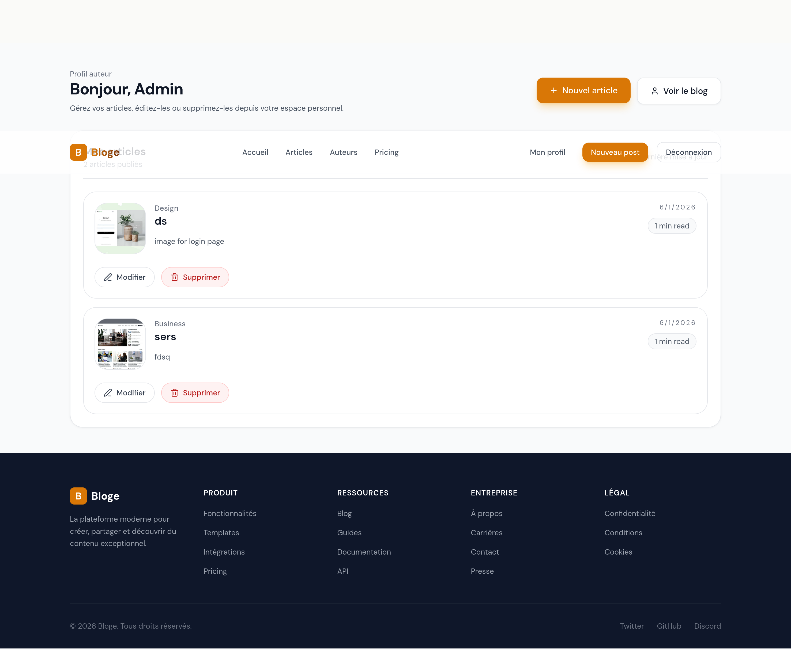

# 📝 Blog Platforme

<div align="center">


**Plateforme de blogging moderne avec gestion d'articles, authentification et upload d'images Cloudinary**

</div>

---

## 📸 Aperçu du Projet

<table>
  <tr>
    <td align="center">
      
      <br><sub><b>Landing Page</b></sub>
    </td>
    <td align="center">
      
      <br><sub><b>Flux d'articles</b></sub>
    </td>
  </tr>
  <tr>
    <td align="center">
      
      <br><sub><b>Détail d'article</b></sub>
    </td>
    <td align="center">
      
      <br><sub><b>Tableau de bord auteur</b></sub>
    </td>
  </tr>
</table>

---

## 🚀 À Propos

**Blog Platforme** est une application fullstack destinée à la création, gestion et publication d'articles de blog. Elle combine une interface frontend moderne et responsive avec un backend sécurisé capable de gérer les utilisateurs, les articles, et les uploads d'images.

### 🎯 Objectif

Fournir une plateforme de blogging professionnelle avec :
- une expérience rédactionnelle fluide,
- une gestion d'images via Cloudinary,
- une authentification sécurisée,
- une interface auteur pour gérer les posts.

---

## ✨ Fonctionnalités

### 🖥️ Frontend
- ✅ **Interface responsive** construite avec React, Vite et Tailwind CSS
- ✅ **Navigation fluide** entre le landing page, le blog, les pages de détail et le dashboard
- ✅ **Gestion des posts** : création, modification et suppression
- ✅ **Aperçu image** pour les formulaires Create/Edit
- ✅ **Affichage dynamique** des articles et des miniatures sur le dashboard
- ✅ **Connexion/inscription** avec gestion des sessions utilisateur

### 🔐 Backend
- ✅ **API RESTful** avec Node.js et Express
- ✅ **Authentification JWT** pour sécuriser les endpoints
- ✅ **Protection des routes** pour les auteurs et admins
- ✅ **Gestion des médias** via Cloudinary
- ✅ **Stockage MongoDB Atlas** pour la base de données
- ✅ **Validation & sécurité** avec `express-validator`, CORS et rate limiting

### 🗂️ Stockage et upload
- ✅ **Images uploadées localement** depuis le navigateur
- ✅ **Stockage Cloudinary** pour toutes les images de posts
- ✅ **Liens sauvegardés dans MongoDB** pour affichage ultérieur

---

## 🛠️ Stack Technique

### Frontend
| Technologie | Usage |
|-------------|-------|
| React | UI et routage | 
| Vite | Bundler rapide | 
| Tailwind CSS | Styling utility-first | 
| React Router | Navigation côté client | 
| Axios | Requêtes API | 

### Backend
| Technologie | Usage |
|-------------|-------|
| Node.js | Runtime serveur | 
| Express | Serveur API REST | 
| MongoDB Atlas | Base de données cloud | 
| Mongoose | ORM MongoDB | 
| Cloudinary | Stockage d'images | 
| multer-storage-cloudinary | Upload multipart | 
| JWT | Authentification | 
| express-validator | Validation des requêtes | 
| express-rate-limit | Limitation de requêtes | 

---

## 📂 Structure du Projet

```
Blog-Platforme/
├── backend/
│   ├── config/                 # Configuration DB et Cloudinary
│   ├── controllers/            # Logique métier des endpoints
│   ├── middleware/             # Auth, validation, gestion d'erreurs
│   ├── models/                 # Schémas Mongoose
│   ├── routes/                 # Routes API
│   ├── server.js               # Serveur Express
│   └── package.json
├── frontend/
│   ├── public/                 # Assets statiques
│   ├── src/
│   │   ├── components/         # Composants réutilisables
│   │   ├── context/            # Auth context
│   │   ├── pages/              # Pages React
│   │   ├── services/           # Appels API
│   │   └── utils/              # Helpers et mocks
│   ├── index.html
│   ├── package.json
│   └── vite.config.js
└── screen_shot/                 # Captures d'écran du projet
```

---

## ⚙️ Installation

### 1. Cloner le dépôt

```bash
git clone <url-du-projet>
cd Blog-Platforme
```

### 2. Configurer le backend

```bash
cd backend
npm install
```

Créez un fichier `.env` dans `backend/` avec ces variables :

```env
MONGO_URI=<votre_mongodb_atlas_uri>
JWT_SECRET=<votre_secret_jwt>
JWT_EXPIRE=7d
CLOUDINARY_CLOUD_NAME=<votre_cloud_name>
CLOUDINARY_API_KEY=<votre_api_key>
CLOUDINARY_API_SECRET=<votre_api_secret>
CLIENT_URL=http://localhost:5173
```

### 3. Configurer le frontend

```bash
cd ../frontend
npm install
```

### 4. Lancer les deux serveurs

#### Backend
```bash
cd backend
npm run dev
```

#### Frontend
```bash
cd frontend
npm run dev
```

---

## 🚀 Démarrage rapide

1. Ouvrez le backend et lancez `npm run dev`
2. Ouvrez le frontend et lancez `npm run dev`
3. Accédez à `http://localhost:5173`
4. Inscrivez-vous ou connectez-vous
5. Créez un post avec une image locale
6. Vérifiez l'article depuis le dashboard et la page blog

---

## 💡 Conseils

- Pour tester Cloudinary, assurez-vous que les variables `.env` sont valides
- Les images sont stockées dans Cloudinary et les URLs sont enregistrées dans MongoDB
- Si une image ne s'affiche pas, vérifiez le champ `image` du post dans la base

---

## 📞 Support

Pour toute question ou amélioration, ouvre un ticket GitHub ou contacte-moi directement.

---

## 🧾 Licence

Ce projet est fourni sous licence MIT.
