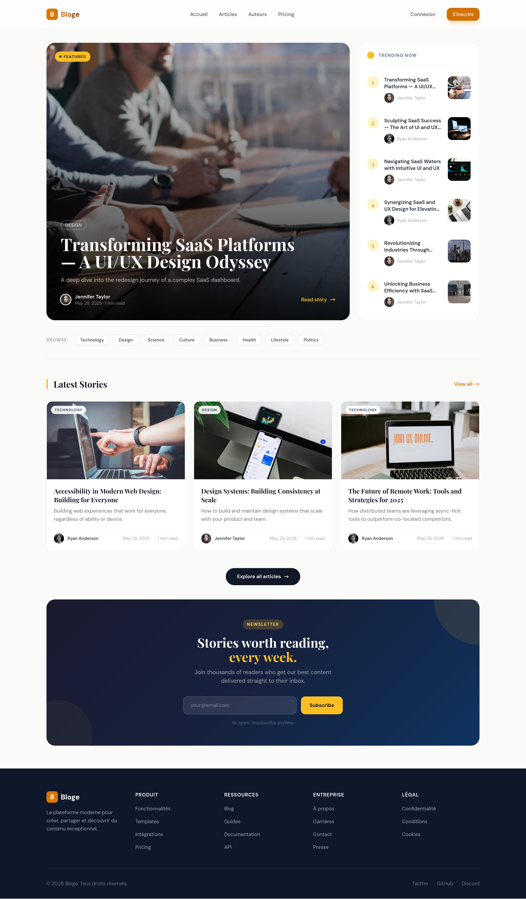
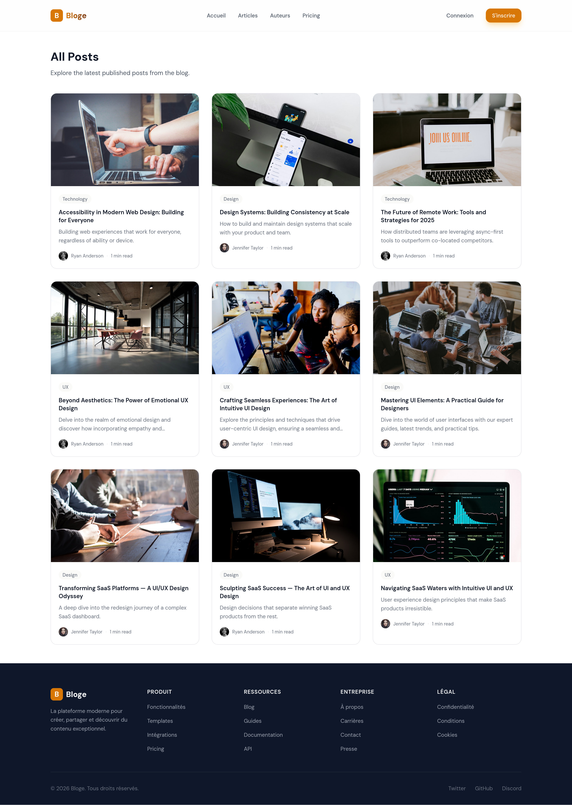
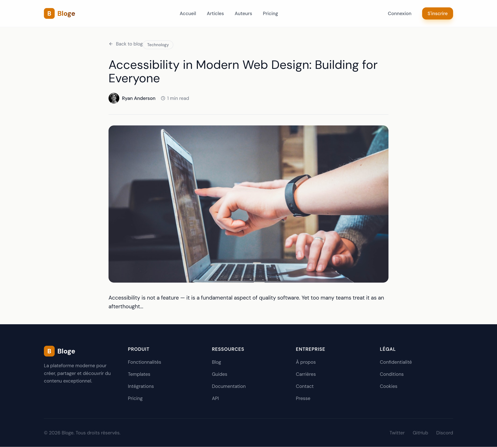

# Blog Platforme

## Présentation
Blog Platforme est une application de blogging moderne construite avec React, Vite et Tailwind CSS côté frontend, et Node.js, Express et MongoDB côté backend.

Ce projet met en avant une expérience utilisateur fluide avec une page d'accueil soignée, des articles présentés comme un vrai blog, un système d'authentification, et la possibilité de créer, éditer et supprimer des publications.

## Fonctionnalités clés

- Page d'accueil moderne avec section article principal et flux de publications récentes
- Navigation claire vers le blog, les détails d'un article, et l'espace de gestion
- Authentification JWT pour les utilisateurs
- Création, modification et suppression d'articles
- Gestion des images via Cloudinary
- Validation et sécurité côté backend

## Architecture

- `frontend/` : application React + Vite + Tailwind CSS
- `backend/` : API RESTful avec Express, MongoDB, Mongoose
- `screen_shot/` : captures d'écran qui montrent l'interface et l'expérience utilisateur

## Stack technique

- Frontend : React 19, Vite, Tailwind CSS, React Router
- Backend : Node.js, Express 5, MongoDB, Mongoose, JSON Web Tokens
- Uploads : Cloudinary via `multer-storage-cloudinary`
- Sécurité : validation avec `express-validator`, protection du backend avec CORS et rate limiting

## Installation

1. Cloner le dépôt

```bash
git clone <url-du-projet>
cd Blog-Platforme
```

2. Installer les dépendances backend

```bash
cd backend
npm install
```

3. Installer les dépendances frontend

```bash
cd ../frontend
npm install
```

## Exécution

### Backend

```bash
cd backend
npm run dev
```

### Frontend

```bash
cd frontend
npm run dev
```

## Captures d'écran

### Landing Page



### Catalogue / Blog



### Article détaillé



### Page de connexion


## Notes

- Vérifiez la configuration de votre fichier `.env` dans le dossier `backend/` pour la connexion MongoDB et les clés Cloudinary.
- Le projet est conçu pour être facilement étendu avec des fonctionnalités supplémentaires comme les commentaires, le tri des articles ou la recherche.

---

*Blog Platforme est un prototype professionnel de blog avec une interface réactive, axée sur le contenu et une expérience lecteurs moderne.*
